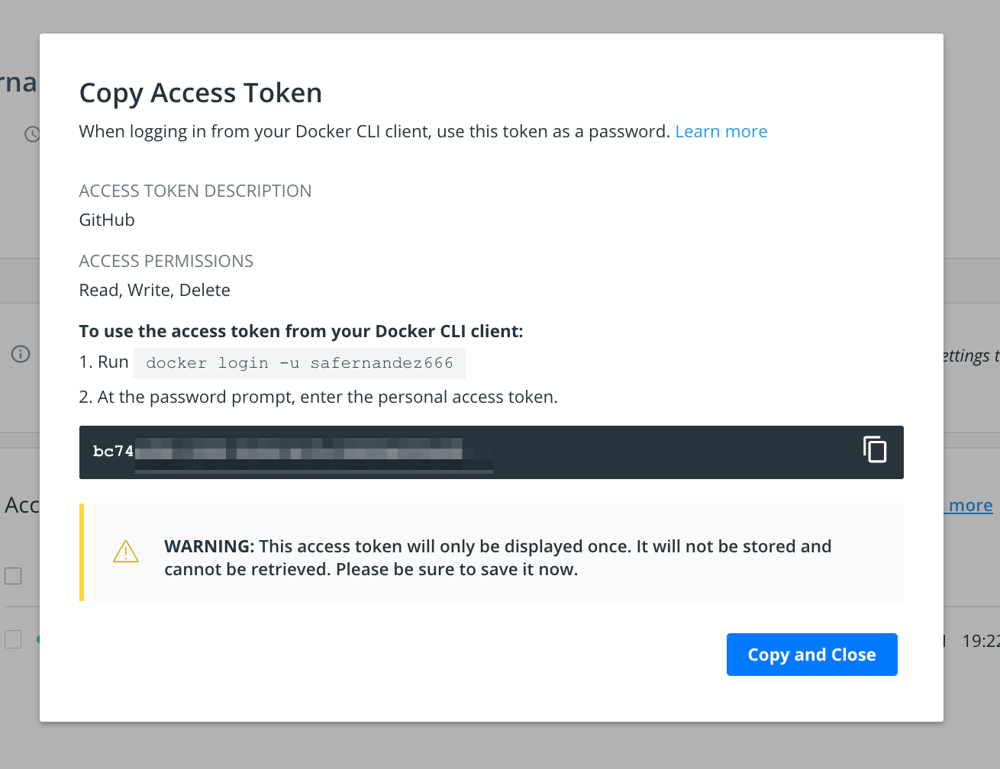
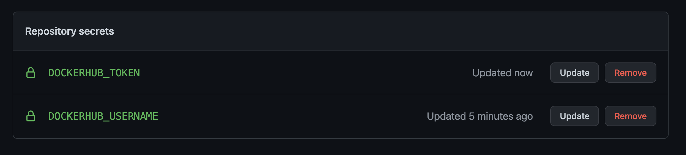
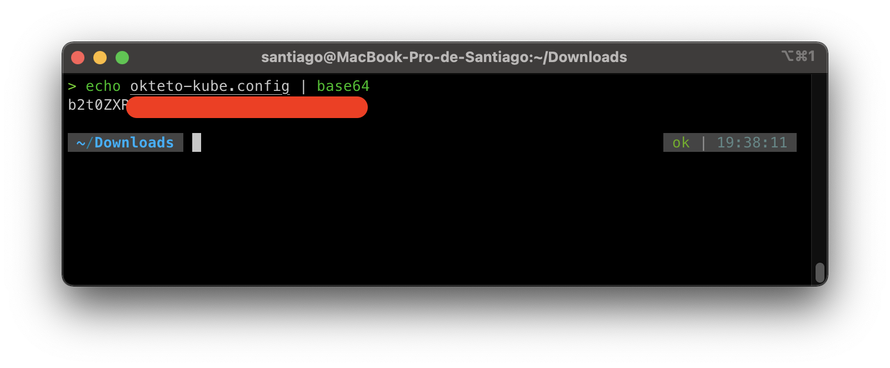
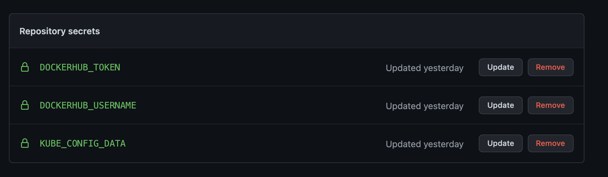

# Github Actions

Realizar un proyecto DevOps con GitHub Actions.

# Primer Paso

Vamos a crear los secretos, para poder hacer el push a nuestro Docker Regestry. En esta caso Docker Hub. El el proyecto GitHub vamos a Settings->Secrets.

Agregamos DOCKERHUB_USERNAME y DOCKERHUB_TOKEN. Para conseguir nuestro Token de Docker Hub, lo haremos en la Web en el apartado Account Settings->Security.

Deberia quedarnos, asi.

### Token Docker Hub

### Secrets GitHub

### Secrets Okteto

Vamos a utilizar un cluster free, como Okteto, para jugar. Descargamos la configuracion y creamos el secreto. Primero vamos a pasarlo a Base64 y luego cargarlo.

Agregamos el Output

